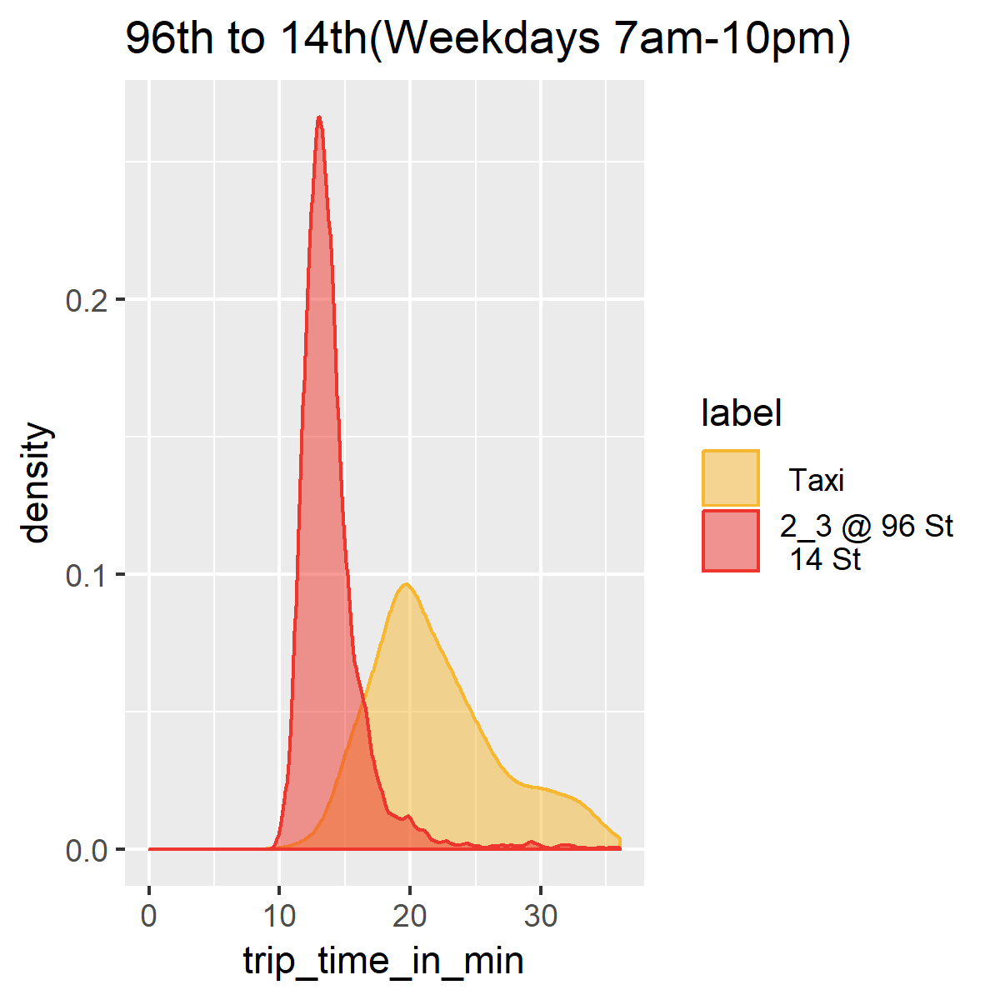
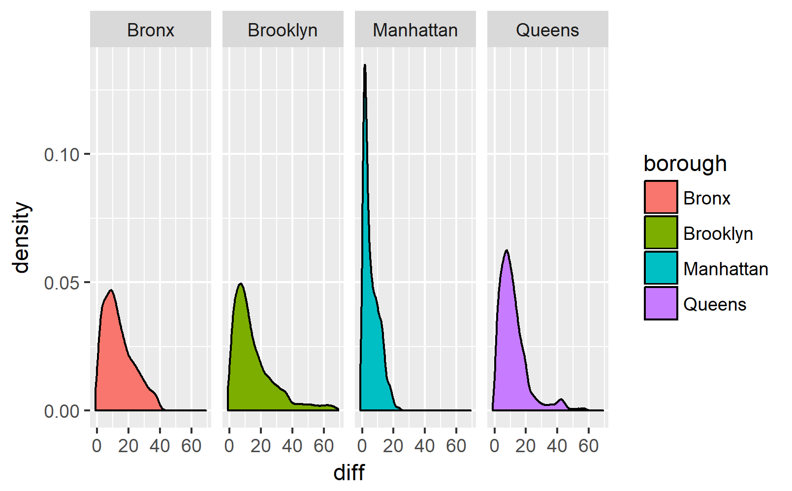
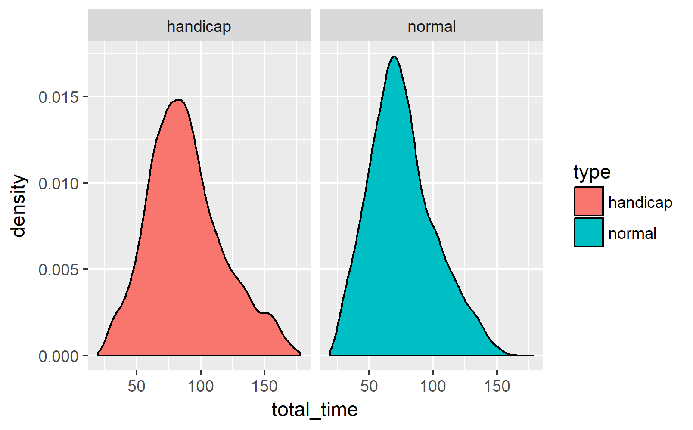
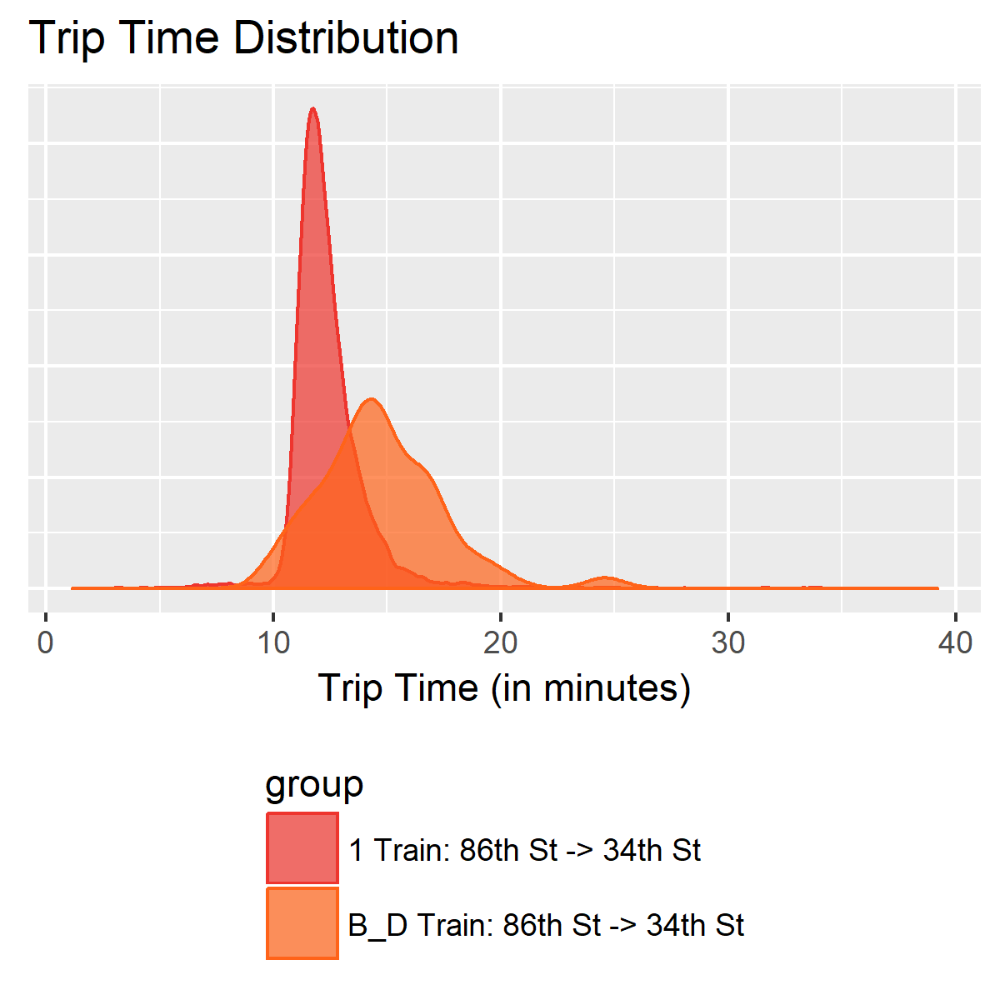
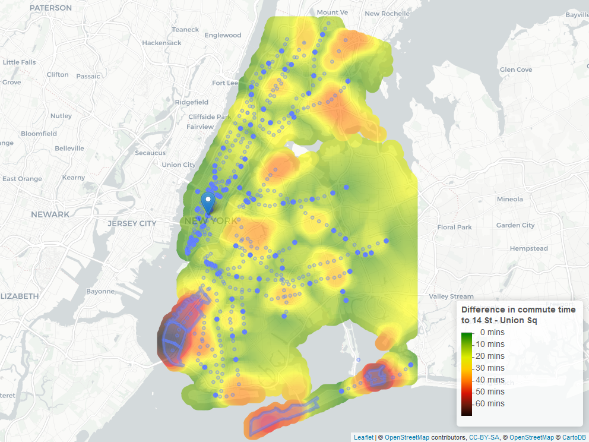
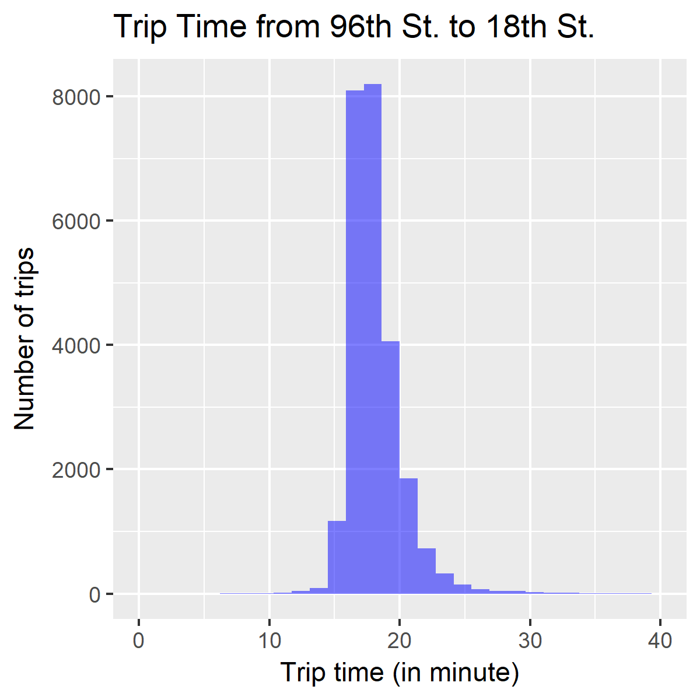
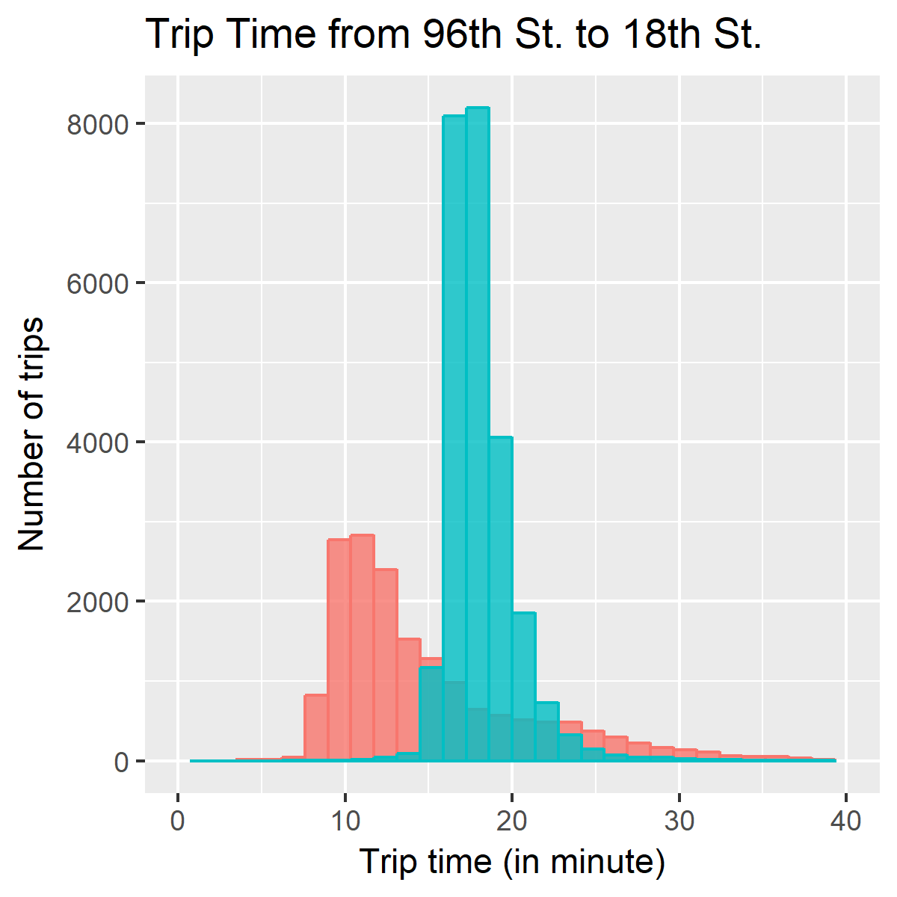

# Figures
## [53rdtoJFK_allday.png](53rdtoJFK_allday.png)

| | |
-|-
**Location** | [../notes/20180802/20180802_Taxi&SubwayComparisonAirport.Rmd](../notes/20180802/20180802_Taxi&SubwayComparisonAirport.Rmd)
**Line Number** |151
**Line** |ggsave(fplot, file = "../../figures/53rdtoJFK_allday.png", width = 4, height = 4)

## [53rdtoJFK_am.png](53rdtoJFK_am.png)

| | |
-|-
**Location** | [../notes/20180802/20180802_Taxi&SubwayComparisonAirport.Rmd](../notes/20180802/20180802_Taxi&SubwayComparisonAirport.Rmd)
**Line Number** |161
**Line** |ggsave(fplot1, file = "../../figures/53rdtoJFK_am.png", width = 4, height = 4)

## [53rdtoJFK_pm.png](53rdtoJFK_pm.png)

| | |
-|-
**Location** | [../notes/20180802/20180802_Taxi&SubwayComparisonAirport.Rmd](../notes/20180802/20180802_Taxi&SubwayComparisonAirport.Rmd)
**Line Number** |170
**Line** |ggsave(fplot3, file = "../../figures/53rdtoJFK_pm.png", width = 4, height = 4)

## [53rdtoJFK_rush.png](53rdtoJFK_rush.png)

| | |
-|-
**Location** | [../notes/20180802/20180802_Taxi&SubwayComparisonAirport.Rmd](../notes/20180802/20180802_Taxi&SubwayComparisonAirport.Rmd)
**Line Number** |166
**Line** |ggsave(fplot2, file = "../../figures/53rdtoJFK_rush.png", width = 4, height = 4)

## [96thStto14th(West).png](96thStto14th(West).png)

| | |
-|-
**Location** | [../notes/20180802/20180802_Taxi&SubwayComparisonAirport.Rmd](../notes/20180802/20180802_Taxi&SubwayComparisonAirport.Rmd)
**Line Number** |224
**Line** |ggsave(plot_c, file = "../../figures/96thStto14th(West).png", width = 4, height = 4) 

## [96thSttoJFk.png](96thSttoJFk.png)

| | |
-|-
**Location** | [../notes/20180802/20180802_Taxi&SubwayComparisonAirport.Rmd](../notes/20180802/20180802_Taxi&SubwayComparisonAirport.Rmd)
**Line Number** |194
**Line** |ggsave(jfk_plot, file = "../../figures/96thSttoJFk.png", width = 4, height = 4) 

## [Commute_time_distribution_by_borough(handicap).png](Commute_time_distribution_by_borough(handicap).png)

| | |
-|-
**Location** | [../notes/20180730/disability_figure_script/create_figures.R](../notes/20180730/disability_figure_script/create_figures.R)
**Line Number** |24
**Line** |ggsave(filename = 'figures/Commute_time_distribution_by_borough(handicap).png', plot_dist_commute_time_by_borough)

## [Commute_time_distribution(normal_vs_handicap).png](Commute_time_distribution(normal_vs_handicap).png)

| | |
-|-
**Location** | [../notes/20180730/disability_figure_script/create_figures.R](../notes/20180730/disability_figure_script/create_figures.R)
**Line Number** |20
**Line** |ggsave(filename = 'figures/Commute_time_distribution(normal_vs_handicap).png', plot_dist_commute_time)

## [compare_two_local_line_density_plot.png](compare_two_local_line_density_plot.png)

| | |
-|-
**Location** | [../notes/20180730/20180730_mean_vs_variance_examples.Rmd](../notes/20180730/20180730_mean_vs_variance_examples.Rmd)
**Line Number** |153
**Line** |ggsave(file = '../../figures/compare_two_local_line_density_plot.png', width = 4, height = 4)

## [Difference_Commute_time_distribution.png](Difference_Commute_time_distribution.png)

| | |
-|-
**Location** | [../notes/20180730/disability_figure_script/create_figures.R](../notes/20180730/disability_figure_script/create_figures.R)
**Line Number** |13
**Line** |ggsave(filename = 'figures/Difference_Commute_time_distribution.png', plot_dist_difference)

## [Difference_Commute_time_distribution_worst_neighborhoods.png](Difference_Commute_time_distribution_worst_neighborhoods.png)

| | |
-|-
**Location** | [../notes/20180730/disability_figure_script/create_figures.R](../notes/20180730/disability_figure_script/create_figures.R)
**Line Number** |32
**Line** |ggsave(filename = 'figures/Difference_Commute_time_distribution_worst_neighborhoods.png', plot_dist_difference_worst_neighborhood)

## [difference_in_coverage.png](difference_in_coverage.png)

| | |
-|-
**Location** | [../notes/20180730/disability_figure_script/create_figures.R](../notes/20180730/disability_figure_script/create_figures.R)
**Line Number** |72
**Line** |  ) %>% mapshot(file = 'difference_in_coverage.png', vwidth = 2000, vheight = 3000)

## [expected_wait_times.png](expected_wait_times.png)

| | |
-|-
**Location** | [../notes/20180801/20180801.Rmd](../notes/20180801/20180801.Rmd)
**Line Number** |222
**Line** |mapshot(map_diff, file = paste("./expected_wait_times.png"))
mapshot(map_median, file = paste("./expected_wait_times.png"))

## [expected_wait_times_worst_case.png](expected_wait_times_worst_case.png)

| | |
-|-
**Location** | [../notes/20180801/20180801.Rmd](../notes/20180801/20180801.Rmd)
**Line Number** |256
**Line** |mapshot(map_diff, file = paste("./expected_wait_times_worst_case.png"))
mapshot(map_perc90, file = paste("./expected_wait_times_worst_case.png"))

## [heat_map_14th_street_median.png](heat_map_14th_street_median.png)
location not found

## [heatmap_difference(normal_vs_handicap).png](heatmap_difference(normal_vs_handicap).png)

| | |
-|-
**Location** | [../notes/20180730/disability_figure_script/create_figures.R](../notes/20180730/disability_figure_script/create_figures.R)
**Line Number** |52
**Line** |mapshot(map_diff, file ='heatmap_difference(normal_vs_handicap).png')

## [heatmap_handicap.png](heatmap_handicap.png)

| | |
-|-
**Location** | [../notes/20180730/disability_figure_script/create_figures.R](../notes/20180730/disability_figure_script/create_figures.R)
**Line Number** |40
**Line** |mapshot(map_wheel, file = 'heatmap_handicap.png')

## [heatmap_normal.png](heatmap_normal.png)

| | |
-|-
**Location** | [../notes/20180730/disability_figure_script/create_figures.R](../notes/20180730/disability_figure_script/create_figures.R)
**Line Number** |46
**Line** |mapshot(map_walking, file = 'heatmap_normal.png')

## [income_v_50P_time_to_34.png](income_v_50P_time_to_34.png)

| | |
-|-
**Location** | [../notes/20180730/20180730_census.Rmd](../notes/20180730/20180730_census.Rmd)
**Line Number** |294
**Line** |ggsave("income_v_50P_time_to_34.png", plot = plot_50, height = 6, width = 18)

## [itin_with_l.png](itin_with_l.png)

| | |
-|-
**Location** | [../notes/20180730/20180730_maps.Rmd](../notes/20180730/20180730_maps.Rmd)
**Line Number** |293
**Line** |# mapshot(map_with,  url = here
mapshot(map_with,  url = here

## [itin_without_l.png](itin_without_l.png)

| | |
-|-
**Location** | [../notes/20180730/20180730_maps.Rmd](../notes/20180730/20180730_maps.Rmd)
**Line Number** |294
**Line** |# mapshot(map_without,  url = here
mapshot(map_without,  url = here

## [local-vs-express-96-14-St.png](local-vs-express-96-14-St.png)

| | |
-|-
**Location** | [../notes/20180717/20180717_mta_triptime_distribution.Rmd](../notes/20180717/20180717_mta_triptime_distribution.Rmd)
**Line Number** |124
**Line** |ggsave(plot = plot, file = here("figures", "local-vs-express-96-14-St.png"), width = 5, height = 4, dpi = 300)

## [local-vs-express+local-96-18-St.png](local-vs-express+local-96-18-St.png)

| | |
-|-
**Location** | [../notes/20180717/20180717_mta_triptime_distribution.Rmd](../notes/20180717/20180717_mta_triptime_distribution.Rmd)
**Line Number** |326
**Line** |ggsave(plot = combined_plot, file = here("figures", "local-vs-express+local-96-18-St.png"), width = 5, height = 4, dpi = 300)

## [map_with_14th_street_marker.png](map_with_14th_street_marker.png)
location not found

## [map_with_72nd to 14th.png](map_with_72nd to 14th.png)
location not found

## [PortAuthority_to_Grand.png](PortAuthority_to_Grand.png)
location not found

## [reliability_tax_map_min_diff.png](reliability_tax_map_min_diff.png)
location not found

## [station_map_going_to_14th_street_median.png](station_map_going_to_14th_street_median.png)
location not found

## [TimesSqtoGunHillRoad_9to3am.png](TimesSqtoGunHillRoad_9to3am.png)

| | |
-|-
**Location** | [../notes/20180802/20180802_Taxi&SubwayComparisonAirport.Rmd](../notes/20180802/20180802_Taxi&SubwayComparisonAirport.Rmd)
**Line Number** |199
**Line** |ggsave(new_plot, file = "../../figures/TimesSqtoGunHillRoad_9to3am.png", width = 4, height = 4) 

## [todd.png](todd.png)
location not found

## [train_map_normal.png](train_map_normal.png)

| | |
-|-
**Location** | [../notes/20180730/network_map.R](../notes/20180730/network_map.R)
**Line Number** |55
**Line** |mapshot(a_map, file = 'train_map_normal.png', vheight = 1500)

## [trips-on-green-line-from-96-to-Fulton-between-7-and-8-am.png](trips-on-green-line-from-96-to-Fulton-between-7-and-8-am.png)

| | |
-|-
**Location** | [../notes/20180730/20180730_itinerary_eval.Rmd](../notes/20180730/20180730_itinerary_eval.Rmd)
**Line Number** |392
**Line** |ggsave(plot = plot, file = here("figures", "trips-on-green-line-from-96-to-Fulton-between-7-and-8-am.png"), width = 8, height = 6, dpi = 300)

## [trip_time_red_line_local.png](trip_time_red_line_local.png)

| | |
-|-
**Location** | [../notes/20180730/20180730_mean_vs_variance_examples.Rmd](../notes/20180730/20180730_mean_vs_variance_examples.Rmd)
**Line Number** |283
**Line** |ggsave(file = '../../figures/trip_time_red_line_local.png', width = 4, height = 4)

## [trip_time_red_line_local_vs_localwexpress.png](trip_time_red_line_local_vs_localwexpress.png)

| | |
-|-
**Location** | [../notes/20180730/20180730_mean_vs_variance_examples.Rmd](../notes/20180730/20180730_mean_vs_variance_examples.Rmd)
**Line Number** |313
**Line** |ggsave(file = '../../figures/trip_time_red_line_local_vs_localwexpress.png', width = 4, height = 4)

## [typical_no_rain.png](typical_no_rain.png)
location not found

## [weather_updated.png](weather_updated.png)
location not found

## [worst_case_no_rain.png](worst_case_no_rain.png)
location not found

## [worst_case_rain.png](worst_case_rain.png)
location not found

## [itin_with_l.html](itin_with_l.html)

| | |
-|-
**Location** | [../notes/20180730/20180730_maps.Rmd](../notes/20180730/20180730_maps.Rmd)
**Line Number** |293
**Line** |# mapshot(map_with,  url = here
mapshot(map_with,  url = here

## [itin_without_l.html](itin_without_l.html)

| | |
-|-
**Location** | [../notes/20180730/20180730_maps.Rmd](../notes/20180730/20180730_maps.Rmd)
**Line Number** |294
**Line** |# mapshot(map_without,  url = here
mapshot(map_without,  url = here

