# Figures
## [53rdtoJFK_allday.png](53rdtoJFK_allday.png)

| | | |
|-|-|-|
|Location | [../notes/20180802/20180802_Taxi&SubwayComparisonAirport.Rmd](../notes/20180802/20180802_Taxi&SubwayComparisonAirport.Rmd)|
|Line Number |151|
|Line |ggsave(fplot, file = "../../figures/53rdtoJFK_allday.png", width = 4, height = 4)|
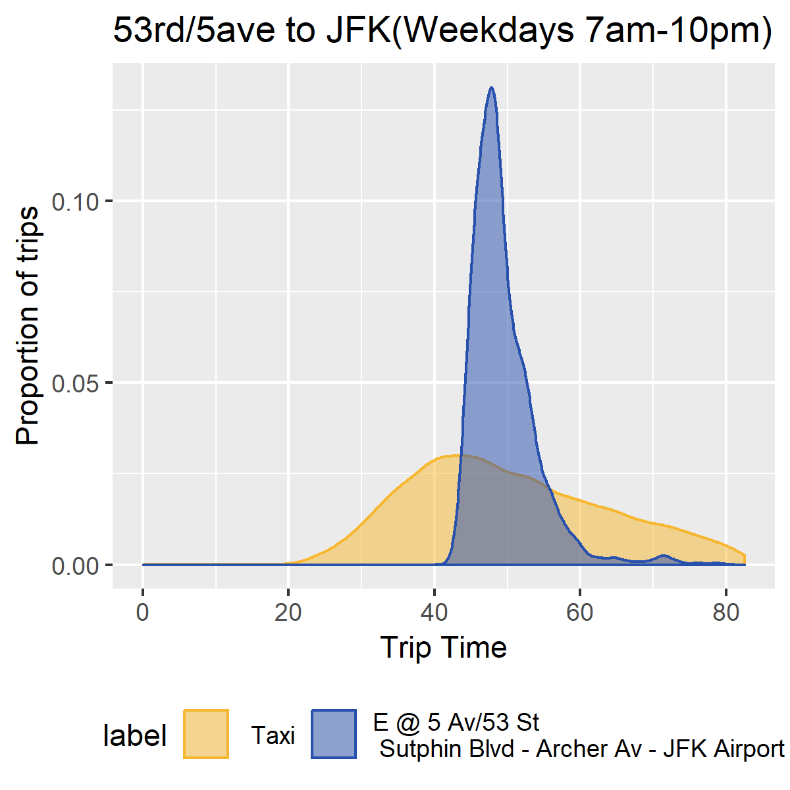

## [53rdtoJFK_am.png](53rdtoJFK_am.png)

| | | |
|-|-|-|
|Location | [../notes/20180802/20180802_Taxi&SubwayComparisonAirport.Rmd](../notes/20180802/20180802_Taxi&SubwayComparisonAirport.Rmd)|
|Line Number |161|
|Line |ggsave(fplot1, file = "../../figures/53rdtoJFK_am.png", width = 4, height = 4)|
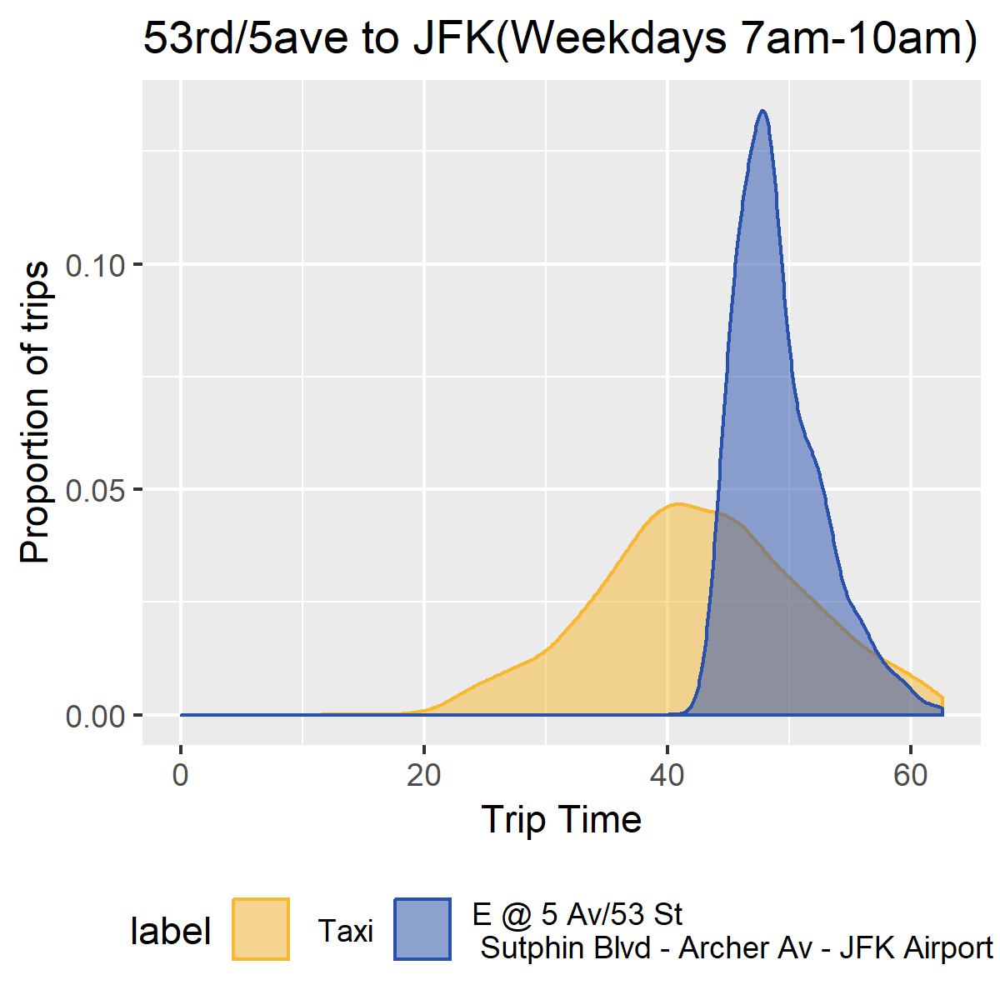

## [53rdtoJFK_pm.png](53rdtoJFK_pm.png)

| | | |
|-|-|-|
|Location | [../notes/20180802/20180802_Taxi&SubwayComparisonAirport.Rmd](../notes/20180802/20180802_Taxi&SubwayComparisonAirport.Rmd)|
|Line Number |170|
|Line |ggsave(fplot3, file = "../../figures/53rdtoJFK_pm.png", width = 4, height = 4)|
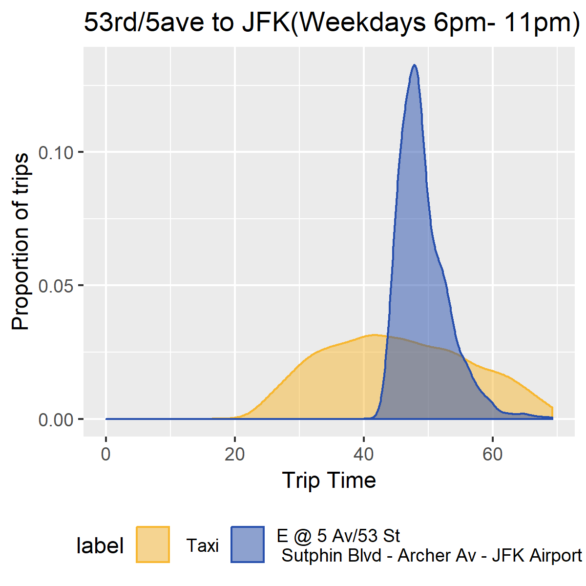

## [53rdtoJFK_rush.png](53rdtoJFK_rush.png)

| | | |
|-|-|-|
|Location | [../notes/20180802/20180802_Taxi&SubwayComparisonAirport.Rmd](../notes/20180802/20180802_Taxi&SubwayComparisonAirport.Rmd)|
|Line Number |166|
|Line |ggsave(fplot2, file = "../../figures/53rdtoJFK_rush.png", width = 4, height = 4)|
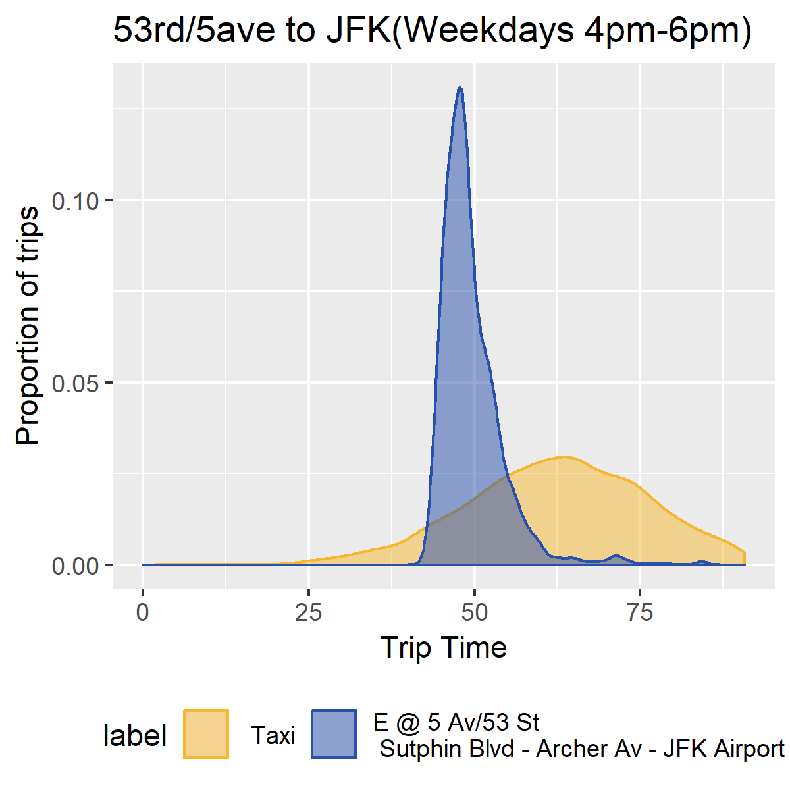

## [96thStto14th(West).png](96thStto14th(West).png)

| | | |
|-|-|-|
|Location | [../notes/20180802/20180802_Taxi&SubwayComparisonAirport.Rmd](../notes/20180802/20180802_Taxi&SubwayComparisonAirport.Rmd)|
|Line Number |224|
|Line |ggsave(plot_c, file = "../../figures/96thStto14th(West).png", width = 4, height = 4)|
.png)

## [96thSttoJFk.png](96thSttoJFk.png)

| | | |
|-|-|-|
|Location | [../notes/20180802/20180802_Taxi&SubwayComparisonAirport.Rmd](../notes/20180802/20180802_Taxi&SubwayComparisonAirport.Rmd)|
|Line Number |194|
|Line |ggsave(jfk_plot, file = "../../figures/96thSttoJFk.png", width = 4, height = 4)|
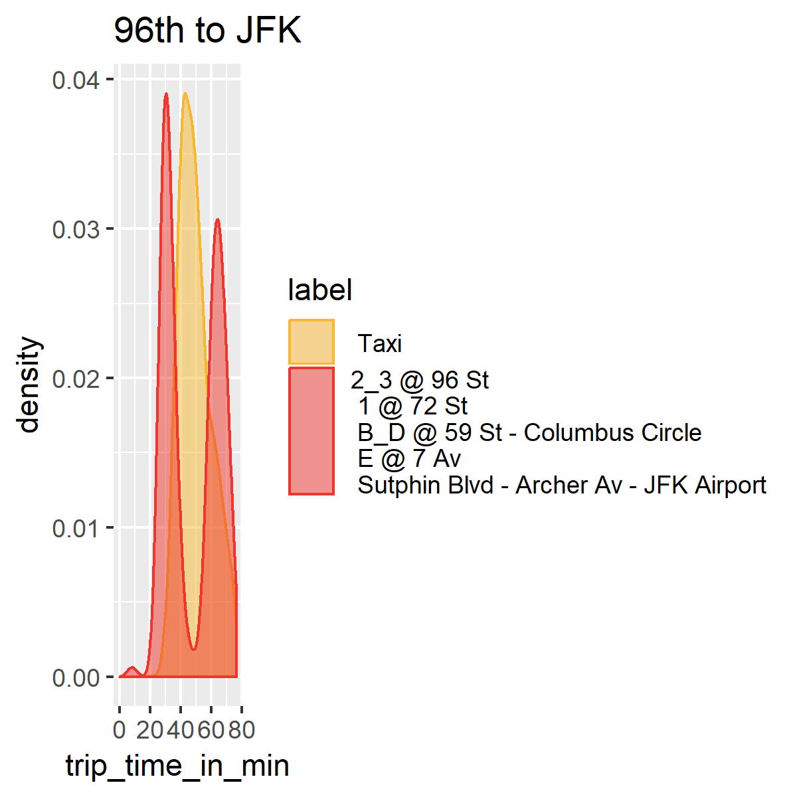

## [auto_readme.sh](auto_readme.sh)
location not found

## [Commute_time_distribution_by_borough(handicap).png](Commute_time_distribution_by_borough(handicap).png)

| | | |
|-|-|-|
|Location | [../notes/20180730/disability_figure_script/create_figures.R](../notes/20180730/disability_figure_script/create_figures.R)|
|Line Number |24|
|Line |ggsave(filename = 'figures/Commute_time_distribution_by_borough(handicap).png', plot_dist_commute_time_by_borough)
|
.png)

## [Commute_time_distribution(normal_vs_handicap).png](Commute_time_distribution(normal_vs_handicap).png)

| | | |
|-|-|-|
|Location | [../notes/20180730/disability_figure_script/create_figures.R](../notes/20180730/disability_figure_script/create_figures.R)|
|Line Number |20|
|Line |ggsave(filename = 'figures/Commute_time_distribution(normal_vs_handicap).png', plot_dist_commute_time)
|
.png)

## [Difference_Commute_time_distribution.png](Difference_Commute_time_distribution.png)

| | | |
|-|-|-|
|Location | [../notes/20180730/disability_figure_script/create_figures.R](../notes/20180730/disability_figure_script/create_figures.R)|
|Line Number |13|
|Line |ggsave(filename = 'figures/Difference_Commute_time_distribution.png', plot_dist_difference)
|
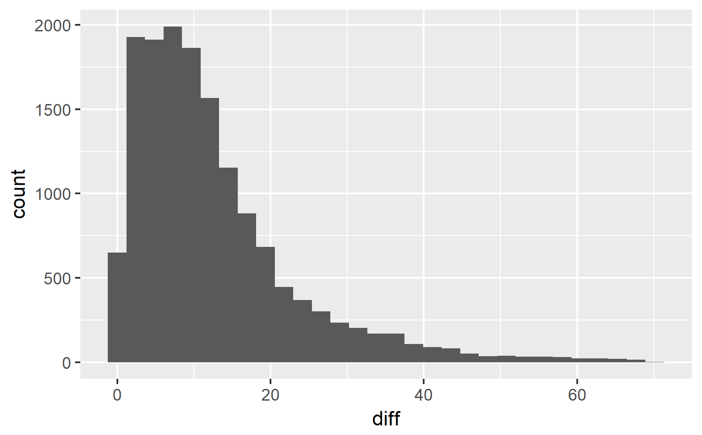

## [Difference_Commute_time_distribution_worst_neighborhoods.png](Difference_Commute_time_distribution_worst_neighborhoods.png)

| | | |
|-|-|-|
|Location | [../notes/20180730/disability_figure_script/create_figures.R](../notes/20180730/disability_figure_script/create_figures.R)|
|Line Number |32|
|Line |ggsave(filename = 'figures/Difference_Commute_time_distribution_worst_neighborhoods.png', plot_dist_difference_worst_neighborhood)
|
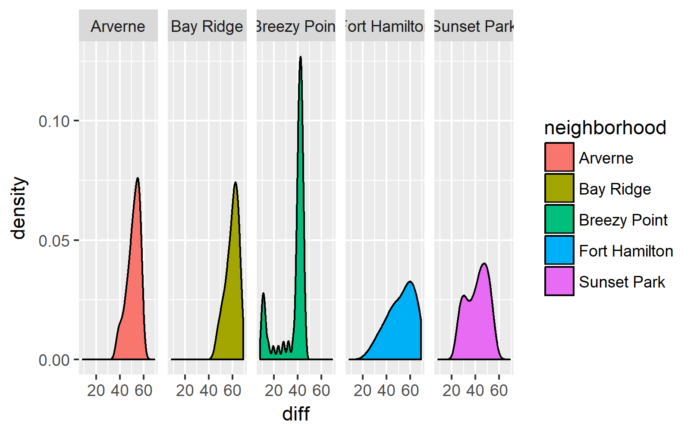

## [difference_in_coverage.png](difference_in_coverage.png)

| | | |
|-|-|-|
|Location | [../notes/20180730/disability_figure_script/create_figures.R](../notes/20180730/disability_figure_script/create_figures.R)|
|Line Number |72|
|Line | ) %>% mapshot(file = 'difference_in_coverage.png', vwidth = 2000, vheight = 3000)
|
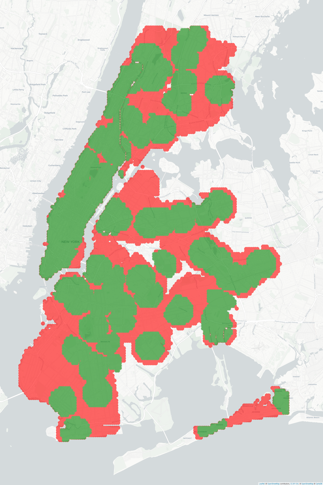

## [distribution-of-wait-times-from-atlantic-to-fulton-super-network.png](distribution-of-wait-times-from-atlantic-to-fulton-super-network.png)

| | | |
|-|-|-|
|Location | [../notes/20180730/20180730_itinerary_eval.Rmd](../notes/20180730/20180730_itinerary_eval.Rmd)|
|Line Number |231|
|Line |ggsave(plot = plot, file = here("figures", "distribution-of-wait-times-from-atlantic-to-fulton-super-network.png"), width = 4, height = 4)|
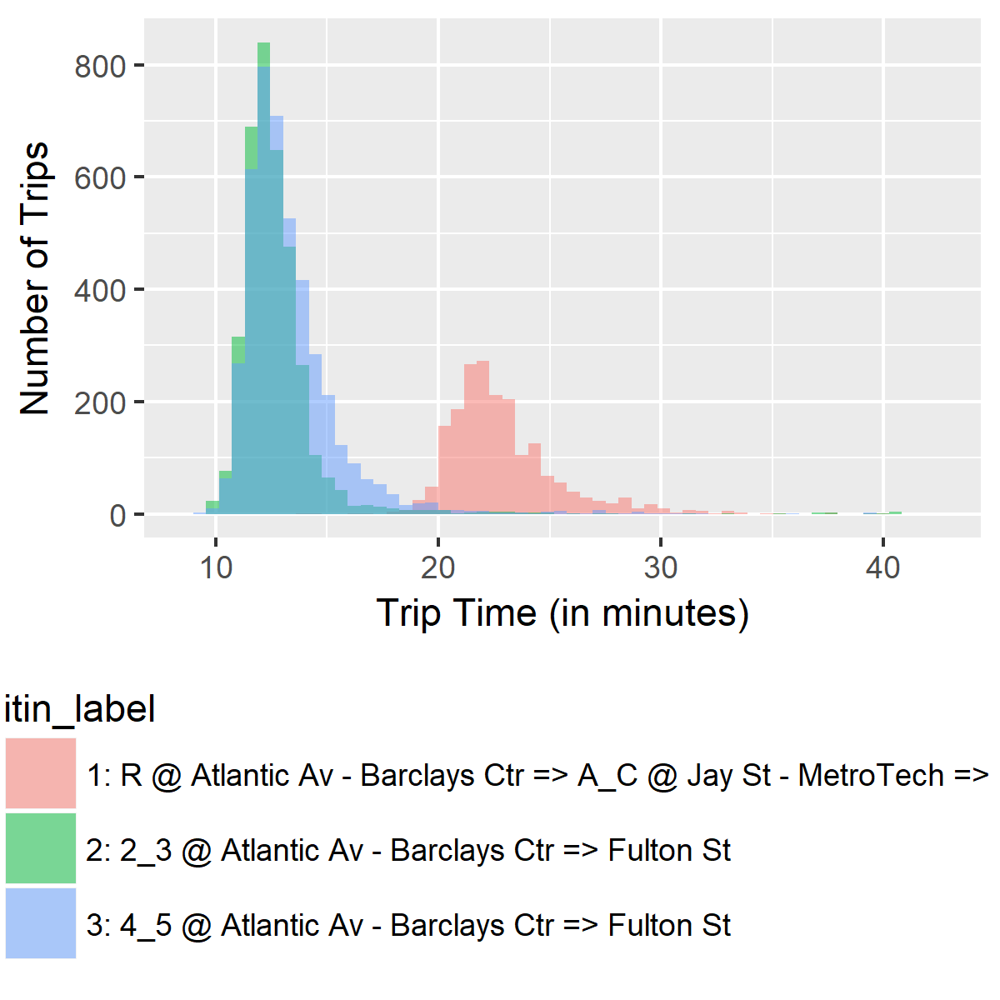

## [expected_wait_times.png](expected_wait_times.png)

| | | |
|-|-|-|
|Location | [../notes/20180801/20180801.Rmd](../notes/20180801/20180801.Rmd)|
|Line Number |222|
|Line |mapshot(map_diff, file = paste("./expected_wait_times.png")) ../notes/20180802/20180802.Rmd|
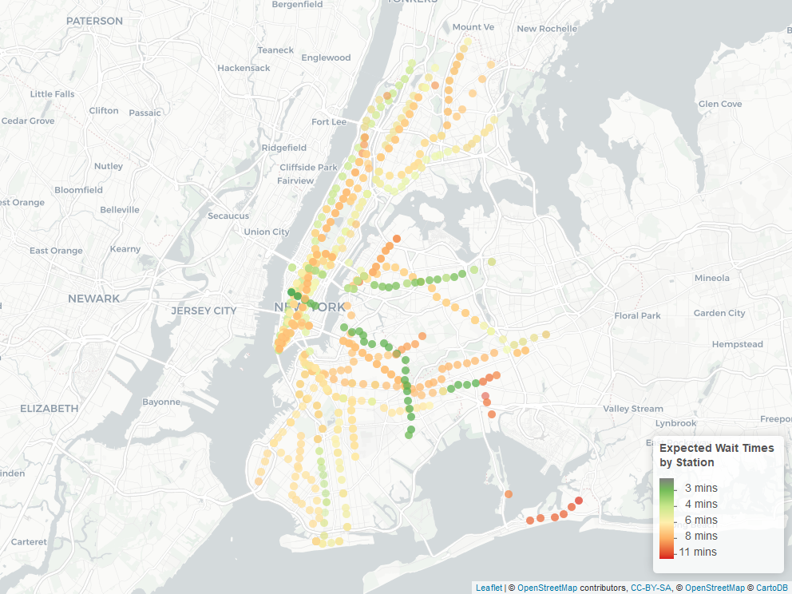

## [expected_wait_times_worst_case.png](expected_wait_times_worst_case.png)

| | | |
|-|-|-|
|Location | [../notes/20180801/20180801.Rmd](../notes/20180801/20180801.Rmd)|
|Line Number |256|
|Line |mapshot(map_diff, file = paste("./expected_wait_times_worst_case.png")) ../notes/20180802/20180802.Rmd|
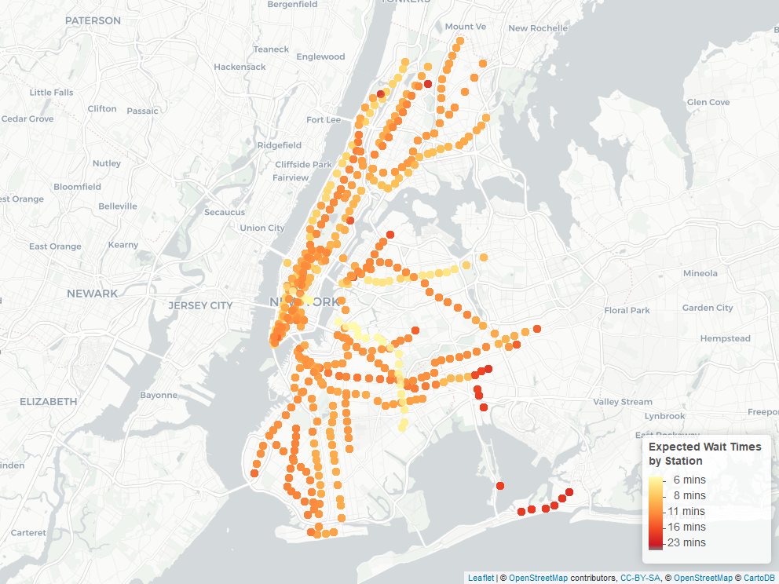

## [find_figs.sh](find_figs.sh)
location not found

## [heat_map_14th_street_median.png](heat_map_14th_street_median.png)
location not found

## [heatmap_difference(normal_vs_handicap).png](heatmap_difference(normal_vs_handicap).png)

| | | |
|-|-|-|
|Location | [../notes/20180730/disability_figure_script/create_figures.R](../notes/20180730/disability_figure_script/create_figures.R)|
|Line Number |52|
|Line |mapshot(map_diff, file ='heatmap_difference(normal_vs_handicap).png')
|
.png)

## [heatmap_handicap.png](heatmap_handicap.png)

| | | |
|-|-|-|
|Location | [../notes/20180730/disability_figure_script/create_figures.R](../notes/20180730/disability_figure_script/create_figures.R)|
|Line Number |40|
|Line |mapshot(map_wheel, file = 'heatmap_handicap.png')
|
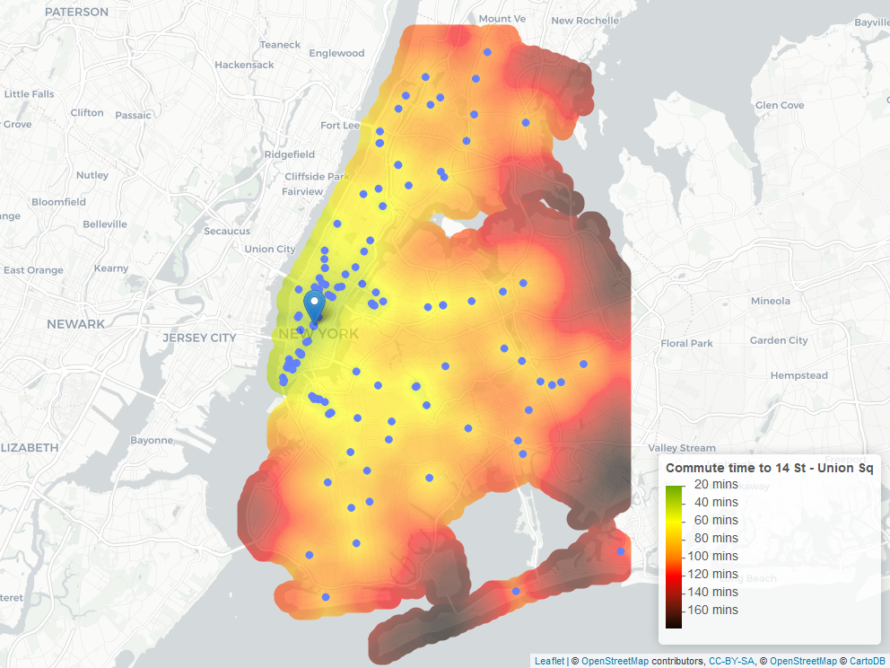

## [heatmap_normal.png](heatmap_normal.png)

| | | |
|-|-|-|
|Location | [../notes/20180730/disability_figure_script/create_figures.R](../notes/20180730/disability_figure_script/create_figures.R)|
|Line Number |46|
|Line |mapshot(map_walking, file = 'heatmap_normal.png')
|
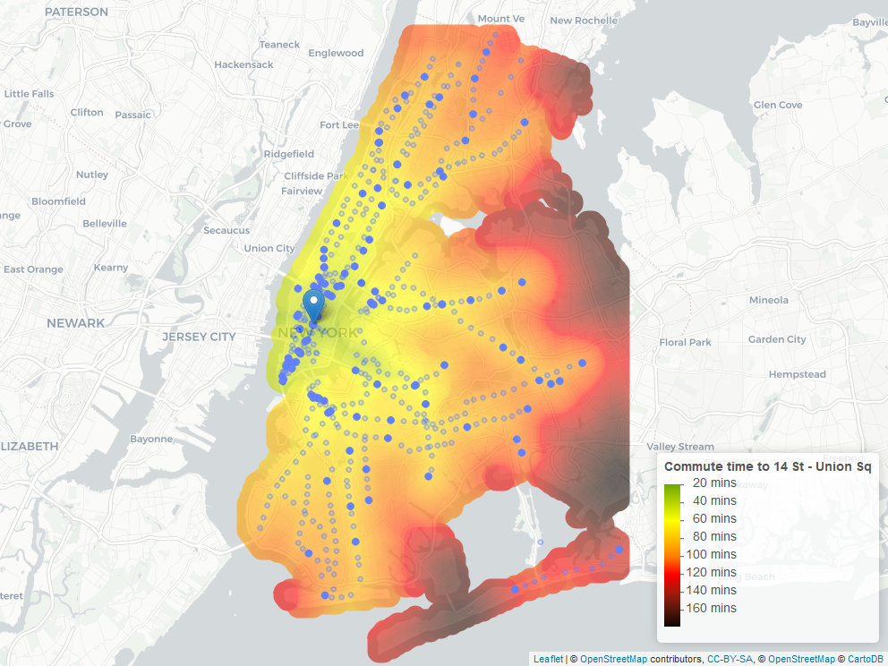

## [income_v_50P_time_to_34.png](income_v_50P_time_to_34.png)

| | | |
|-|-|-|
|Location | [../notes/20180730/20180730_census.Rmd](../notes/20180730/20180730_census.Rmd)|
|Line Number |294|
|Line |ggsave("income_v_50P_time_to_34.png", plot = plot_50, height = 6, width = 18)|
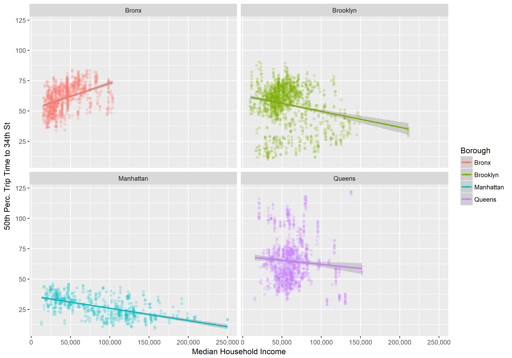

## [itin_with_l.html](itin_with_l.html)

| | | |
|-|-|-|
|Location | [../notes/20180730/20180730_maps.Rmd](../notes/20180730/20180730_maps.Rmd)|
|Line Number |293|
|Line |# mapshot(map_with, url = here|

## [itin_with_l.png](itin_with_l.png)

| | | |
|-|-|-|
|Location | [../notes/20180730/20180730_maps.Rmd](../notes/20180730/20180730_maps.Rmd)|
|Line Number |293|
|Line |# mapshot(map_with, url = here|
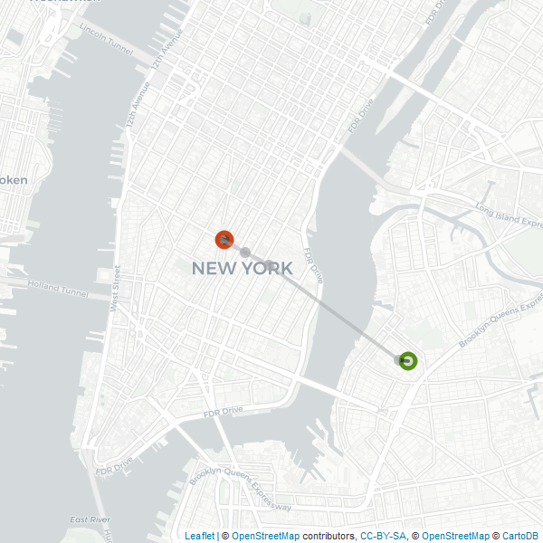

## [itin_without_l.html](itin_without_l.html)

| | | |
|-|-|-|
|Location | [../notes/20180730/20180730_maps.Rmd](../notes/20180730/20180730_maps.Rmd)|
|Line Number |294|
|Line |# mapshot(map_without, url = here|

## [itin_without_l.png](itin_without_l.png)

| | | |
|-|-|-|
|Location | [../notes/20180730/20180730_maps.Rmd](../notes/20180730/20180730_maps.Rmd)|
|Line Number |294|
|Line |# mapshot(map_without, url = here|
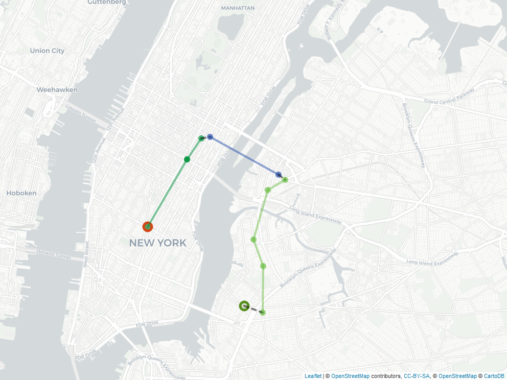

## [local-vs-express-96-14-St.png](local-vs-express-96-14-St.png)

| | | |
|-|-|-|
|Location | [../notes/20180717/20180717_mta_triptime_distribution.Rmd](../notes/20180717/20180717_mta_triptime_distribution.Rmd)|
|Line Number |124|
|Line |ggsave(plot = plot, file = here("figures", "local-vs-express-96-14-St.png"), width = 5, height = 4, dpi = 300)|
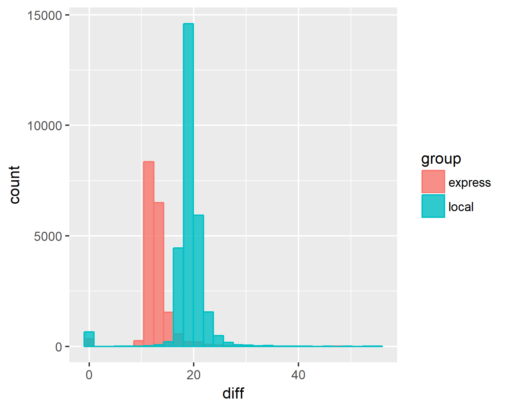

## [local-vs-express+local-96-18-St.png](local-vs-express+local-96-18-St.png)

| | | |
|-|-|-|
|Location | [../notes/20180717/20180717_mta_triptime_distribution.Rmd](../notes/20180717/20180717_mta_triptime_distribution.Rmd)|
|Line Number |326|
|Line |ggsave(plot = combined_plot, file = here("figures", "local-vs-express+local-96-18-St.png"), width = 5, height = 4, dpi = 300)|
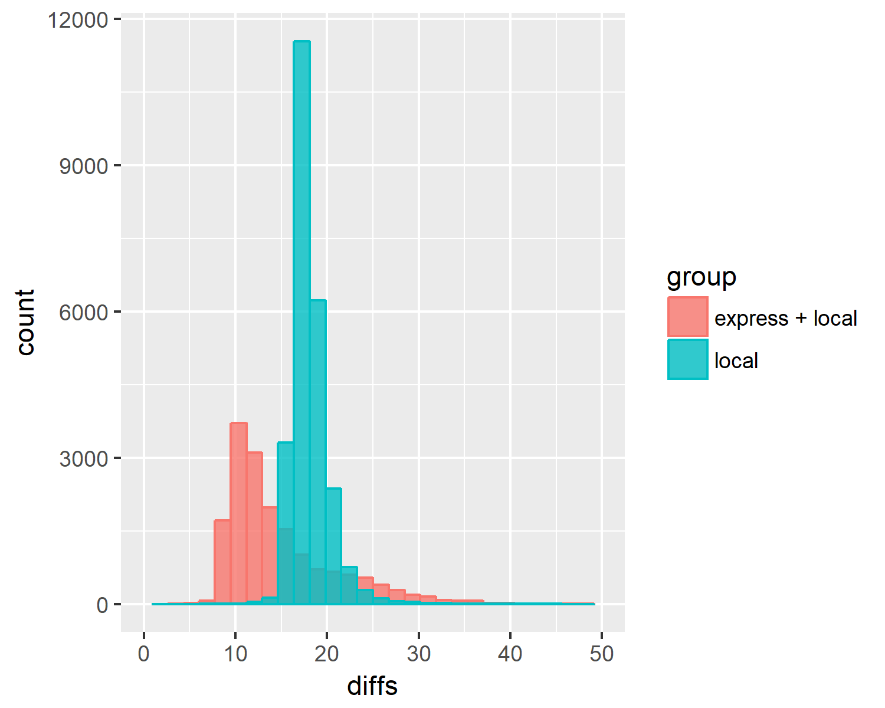

## [map_with_14th_street_marker.png](map_with_14th_street_marker.png)
location not found

## [map_with_72nd to 14th.png](map_with_72nd to 14th.png)
location not found

## [output.txt](output.txt)
location not found

## [PortAuthority_to_Grand.png](PortAuthority_to_Grand.png)
location not found

## [README.md](README.md)
location not found

## [reliability_tax_map_min_diff.png](reliability_tax_map_min_diff.png)
location not found

## [station_map_going_to_14th_street_median.png](station_map_going_to_14th_street_median.png)
location not found

## [t](t)

| | | |
|-|-|-|
|Location | [../data/clean_google_transit_subway_static.R](../data/clean_google_transit_subway_static.R)|
|Line Number |1|
|Line |library(tidyverse)
 ../data/clean_google_transit_subway_static.R|

## [TimesSqtoGunHillRoad_9to3am.png](TimesSqtoGunHillRoad_9to3am.png)

| | | |
|-|-|-|
|Location | [../notes/20180802/20180802_Taxi&SubwayComparisonAirport.Rmd](../notes/20180802/20180802_Taxi&SubwayComparisonAirport.Rmd)|
|Line Number |199|
|Line |ggsave(new_plot, file = "../../figures/TimesSqtoGunHillRoad_9to3am.png", width = 4, height = 4)|
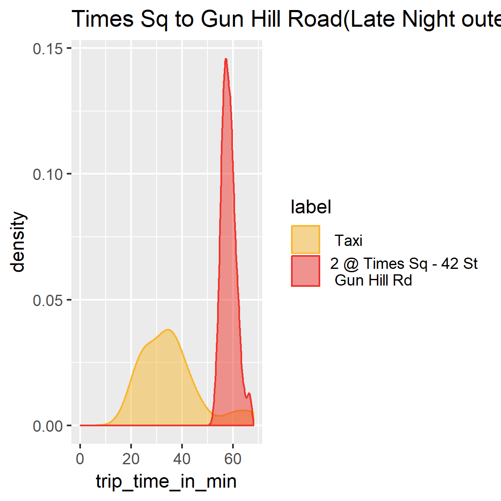

## [todd.png](todd.png)
location not found

## [train_map_normal.png](train_map_normal.png)

| | | |
|-|-|-|
|Location | [../notes/20180730/network_map.R](../notes/20180730/network_map.R)|
|Line Number |55|
|Line |mapshot(a_map, file = 'train_map_normal.png', vheight = 1500)|
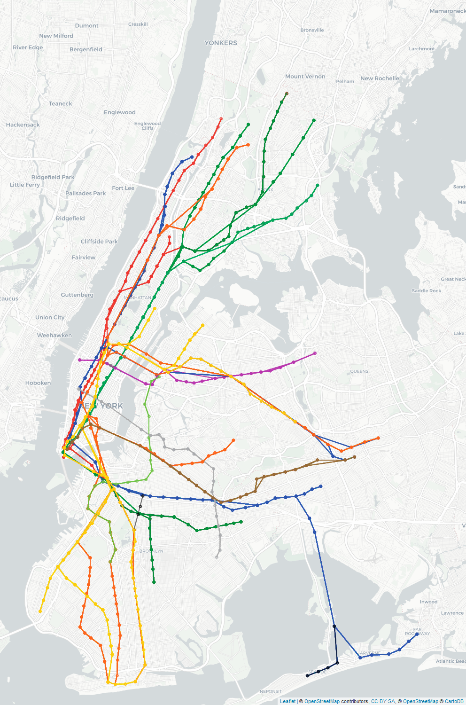

## [trips-on-green-line-from-96-to-Fulton-between-7-and-8-am.png](trips-on-green-line-from-96-to-Fulton-between-7-and-8-am.png)

| | | |
|-|-|-|
|Location | [../notes/20180730/20180730_itinerary_eval.Rmd](../notes/20180730/20180730_itinerary_eval.Rmd)|
|Line Number |387|
|Line |ggsave(plot = plot, file = here("figures", "trips-on-green-line-from-96-to-Fulton-between-7-and-8-am.png"), width = 8, height = 6, dpi = 300)|
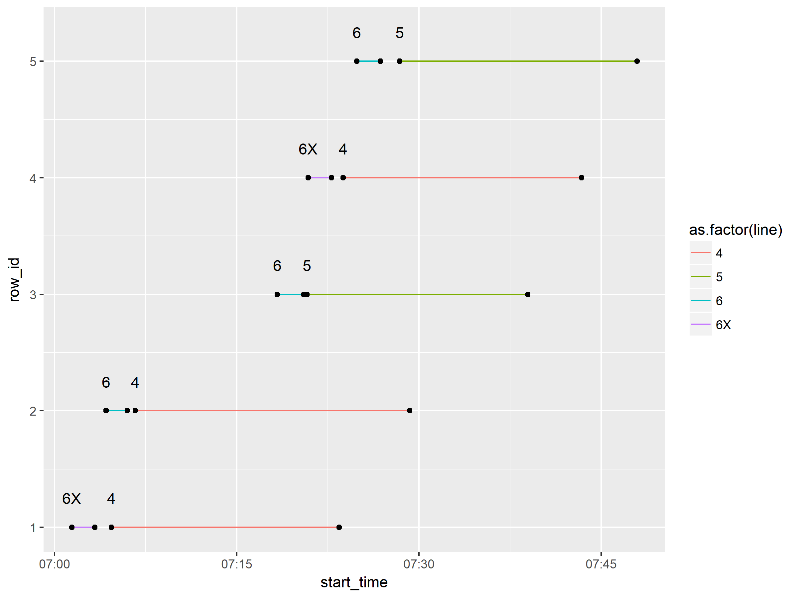

## [typical_no_rain.png](typical_no_rain.png)
location not found

## [weather_updated.png](weather_updated.png)
location not found

## [worst_case_no_rain.png](worst_case_no_rain.png)
location not found

## [worst_case_rain.png](worst_case_rain.png)
location not found

